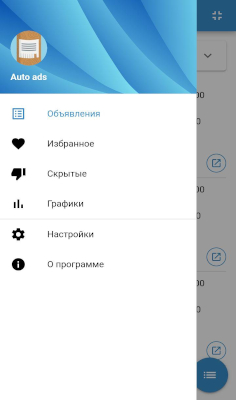
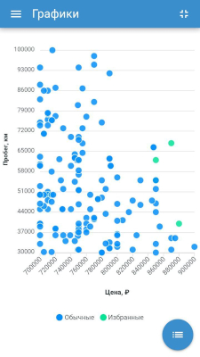
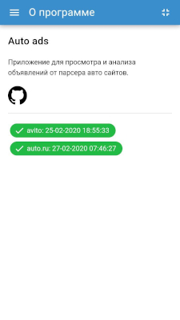

# Client (auto-ads-parser)

Гибридное приложение на основе фреймворка [Quasar](https://quasar.dev/). Скриншоты:

   
    
  

## Основные команды
### Установка зависимостей
```bash
npm install
```

### Старт приложения в режиме разработки
SPA:
```bash
npm run dev
```

Android:
```bash
npm run android-dev
```

### Линтер файлов
```bash
npm run lint
```

### Сборка android приложения
```bash
npm run android-build
```
